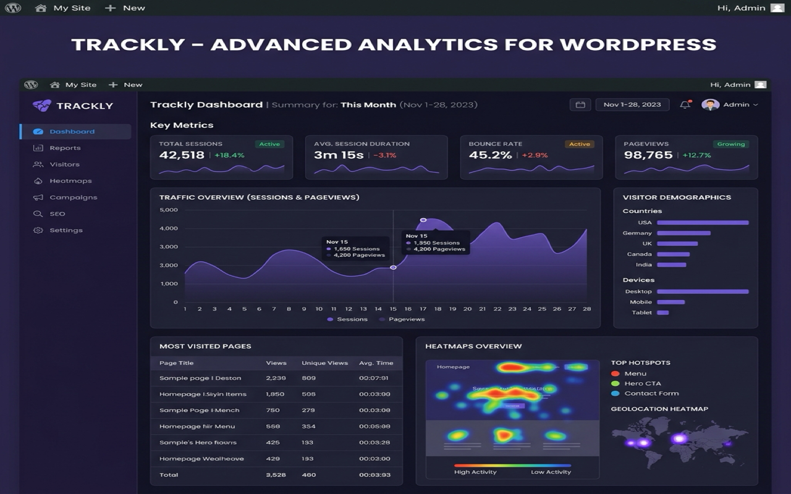
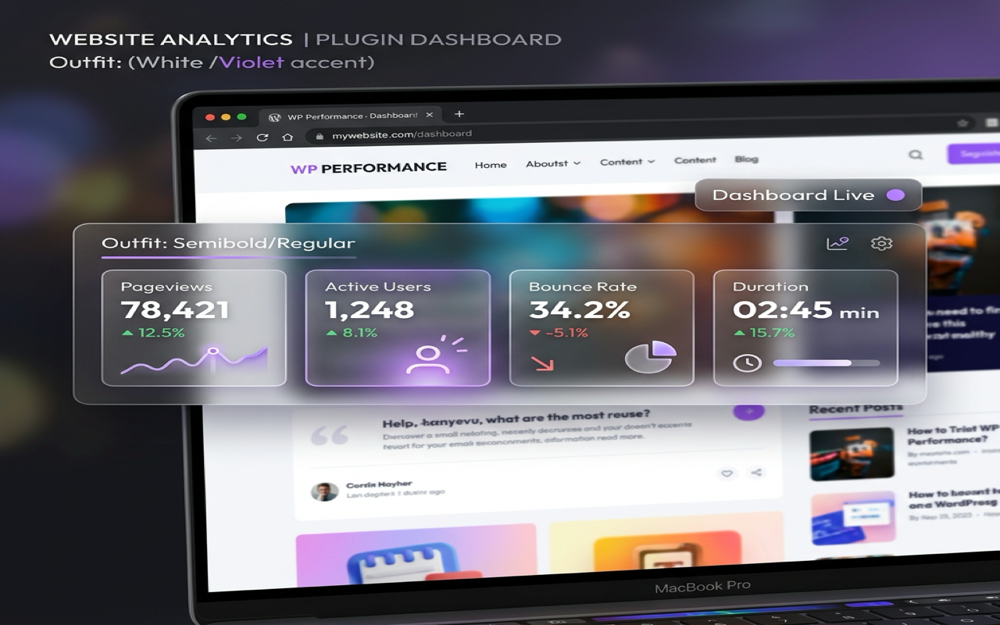

<p align="center">
  
</p>

<h1 align="center">DataMetric 📊</h1>

<p align="center">
  A modern, GDPR-conscious <strong>Google Analytics 4 (GA4)</strong> dashboard, local click heatmap tracker,
  and statistical anomaly insight engine for WordPress — with a dependency-free front-end tracker and a visual GA4 event builder.
</p>

<p align="center">
  <a href="https://github.com/yonetici/metricpulse/actions/workflows/lint.yml"></a>
  
  
  
</p>

<p align="center">
  📣 <strong><a href="https://www.ridvanbilgin.com/2026/07/datametric-wordpress-ga4-analytics-plugin.html">Read the introduction post →</a></strong>
</p>

---

## ✨ Overview

**DataMetric** brings the analytics that matter into your WordPress admin, without sacrificing performance or privacy. Standard visitors download only an **under-5&nbsp;KB, dependency-free (vanilla JS) tracker**; the heavy dashboard interface is loaded exclusively for logged-in administrators. All GA4 requests are batched, cached, and quota-aware. Everything — including the click heatmap — is fully explorable in **Demo Mode** the moment you activate the plugin, with **zero setup**.

> **Note:** GA4 anomaly insights are produced by classic **mean + standard deviation** statistics — not machine learning. Honest math, clearly labeled.

## 🚀 Features

- **GA4 dashboard** — Users, Sessions, Pageviews, Engagement Rate, Bounce Rate, and Avg. Session Duration KPIs, plus a multi-series 7/30-day traffic trend.
- **Traffic acquisition** — Source/medium (referrer) breakdown with sessions, users, engagement rate, and key events (conversions).
- **Local click heatmap** — See where visitors click, rendered as an overlay on your own pages. Stored in your own database, no PII, auto-purged after 30 days. In **Demo Mode** it shows a representative sample heatmap so you can try it instantly.
- **Realtime** — Live active-visitor count with a "last 30 minutes" sparkline.
- **Audience & geography** — Top landing pages, top countries, top events, device distribution, and a new-vs-returning split.
- **Visual GA4 event builder** — Define custom GA4 events by clicking elements on the page — no code required.
- **Demo Mode (zero setup)** — Preview the *entire* plugin — every GA4 report **and** the click heatmap — with realistic mock data, no GA4 connection or click data required. Active by default until you connect a GA4 property.
- **Privacy-first** — Strict opt-in tracking that integrates with Complianz, Borlabs, CookieLawInfo, and Google Consent Mode v2.

## 🖼️ Screenshots

| Admin dashboard | Front-end overlay |
| :---: | :---: |
|  |  |

## ✅ Requirements

| | |
| --- | --- |
| **WordPress** | 6.0 or higher (tested up to 7.0) |
| **PHP** | 8.1 or higher |
| **Data source** | A Google Analytics 4 property + Google Cloud Service Account (optional — Demo Mode works without one) |

## 📦 Installation

1. Download the latest plugin ZIP (build it with `python3 bin/minify.py` then zip the `datametric-analytics-heatmaps/` folder, or grab it from the [Releases](https://github.com/yonetici/metricpulse/releases) page).
2. In WordPress, go to **Plugins → Add New → Upload Plugin**, choose the ZIP, and activate.
3. Open **DataMetric** in the admin menu. It starts in **Demo Mode** so you can explore immediately.
4. To connect real data, follow the [Installation & GA4 setup guide](docs/INSTALL.md).

## ⚙️ Configuration

DataMetric authenticates to the GA4 Data API with a **Service Account** (RS256-signed JWT). Provide credentials via any of:

- The **Settings** screen (JSON is encrypted at rest with AES-256-GCM), or
- The `DATAMETRIC_GA_JSON` constant / environment variable, or
- A secrets file at `/etc/secrets/datametric.json`.

Step-by-step instructions: **[docs/INSTALL.md](docs/INSTALL.md)**.

## 📖 Usage

**Dashboard (wp-admin).** Open **DataMetric** in the admin menu. In Demo Mode you immediately see mock KPIs, the traffic trend, acquisition, device/country breakdowns, realtime, and more. Connect a GA4 property to switch every report to live data.

**Click heatmap (front-end overlay).** The heatmap renders on your *actual* pages, not inside wp-admin:

1. While logged in as an administrator, visit any page on the front end of your site.
2. Click the floating **DataMetric** button (bottom-right) to open the glassmorphic panel.
3. Go to the **Click Heatmap** tab and press **Show Heatmap** — click-density dots are overlaid on the page. In Demo Mode a representative sample heatmap is shown; with a live setup it reflects real recorded clicks for that page.

**GA4 Event Builder.** In the same front-end panel, open the **Event Builder** tab, click **Start Element Selection**, pick any button or link, name your GA4 event, and save. Clicks on that element are then sent to GA4 via `gtag` — no code required.

## 🧩 Repository Structure

```
datametric-analytics-heatmaps/   # The WordPress plugin (this is what ships)
├── datametric-analytics-heatmaps.php # Plugin bootstrap: constants, PSR-4 autoloader, activation
├── uninstall.php            # Multisite-aware, opt-in data cleanup
├── Includes/                # Core, Database, GA4 API client, Repository, Services, Migration
├── Admin/                   # Admin dashboard, REST endpoints, ApexCharts scripts & styles
├── Frontend/                # Public tracker + glassmorphic on-site overlay
├── tests/                   # PHPUnit test suite
└── readme.txt               # WordPress.org readme

assets/                      # WordPress.org banner, icon, screenshots
bin/minify.py                # Minifies CSS/JS source into .min.* assets
docs/                        # INSTALL, HOOKS, TROUBLESHOOT guides
```

## 🛠️ Development

```bash
# Install dev dependencies (PHPUnit)
cd datametric-analytics-heatmaps && composer install

# Run the test suite
vendor/bin/phpunit

# Rebuild minified assets after editing CSS/JS
python3 bin/minify.py
```

- **Architecture:** PSR-4 autoloaded (`DataMetric\` namespace), with a layered service/repository design and facade classes (`Api`, `Database`).
- **Charts:** [ApexCharts](https://github.com/apexcharts/apexcharts.js) is bundled locally (no remote CDN).
- **CI:** GitHub Actions runs PHP lint + PHPUnit on every push/PR (see [`.github/workflows/lint.yml`](.github/workflows/lint.yml)).

## 📚 Documentation

- 📥 [Installation & GA4 setup](docs/INSTALL.md)
- 🪝 [Action & filter hooks](docs/HOOKS.md)
- 🧯 [Troubleshooting](docs/TROUBLESHOOT.md)

## 🔒 Privacy

Click telemetry contains **no IP address or personal identifiers** — only the page path, clicked element, and normalized coordinates — and is stored locally in your own database, then automatically deleted after 30 days. See the plugin's [readme.txt](datametric-analytics-heatmaps/readme.txt) for the full privacy statement and the list of external services (GA4 Data API).

## 🤝 Contributing

Contributions are welcome! Please:

1. Follow **WordPress Coding Standards (WPCS)** for all PHP.
2. Wrap user-facing strings in i18n functions (`__()`, `esc_html__()`, …) using the `datametric-analytics-heatmaps` text domain.
3. Never commit unencrypted credentials, and always use `$wpdb->prepare()` for dynamic queries.
4. Add/adjust PHPUnit tests for behavioral changes and run the suite before opening a PR.

## 📄 License

Released under the **[GPLv2 or later](https://www.gnu.org/licenses/gpl-2.0.html)** license.

---

<p align="center">
  Developed by <a href="https://ridvanbilgin.com">Rıdvan Bilgin</a>.
  <br>
  <em>Google Analytics and GA4 are trademarks of Google LLC; this project is not endorsed by or affiliated with Google.</em>
</p>
